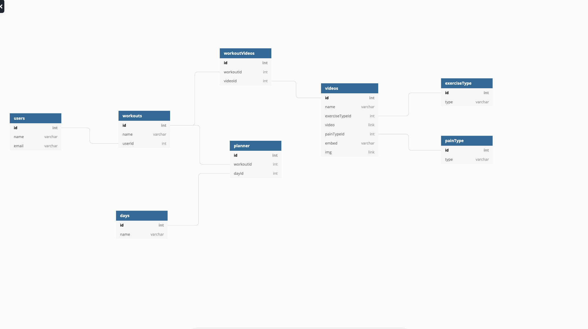
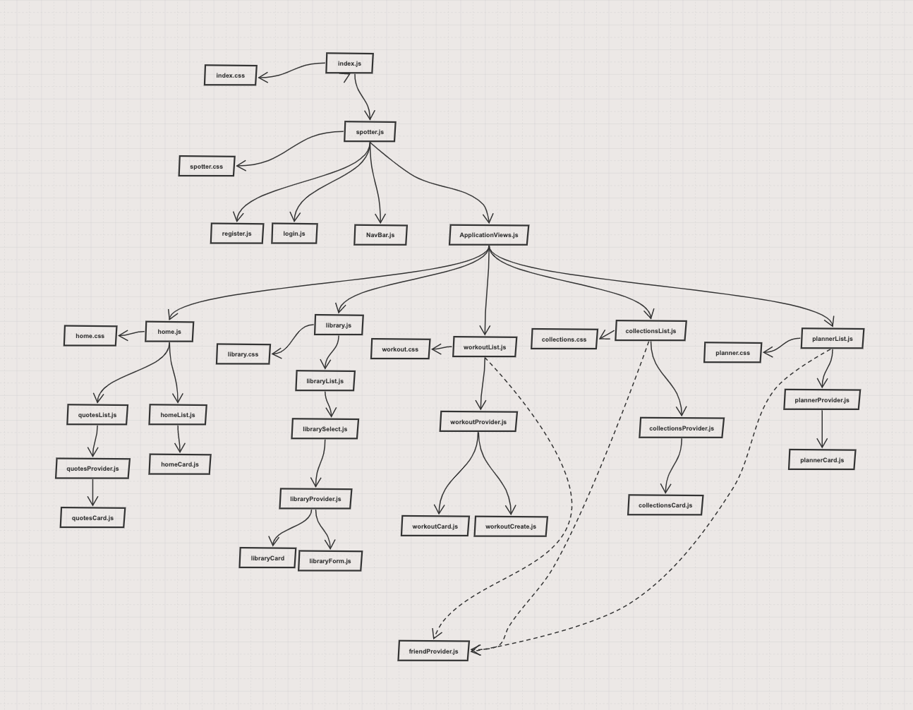

# spotter
Spotter is a fitness application for users to browse a curated library of exercise videos and construct their own workouts by making their own playlists out of their selection of videos in the library.

## Motivation
Many exercise programs cause injury because of their high-intensity, or because of the user's inexperience.
Spotter solves this by curating it's library to feature videos from sources which clearly show how to do execute each exercise in a safe way.
We want our users to workout confidently knowing they can build strength without causing other aches and pains. We want them to spend more time in the gym and less time with ice.
This application serves as my font-end capstone project for my cohort at Nashville Software School Jan-Jun 2021. 

## Screenshots

## Tech used
Built with **React**

Styled with **CSS** and **React Bootstrap**

## Features
**Video Library** for users to browse

**Workotus** created by users which serve as playlists of their favorite videos. Users can organize and save their workouts however they like for future use

**Planner** for scheduling user-created workouts for the coming week. The planner displays any workout the user has saved for the current day, as well as providing an option to view all planned workouts 

**User Specific** data for workouts and planner, but the video library is provided equally to all users